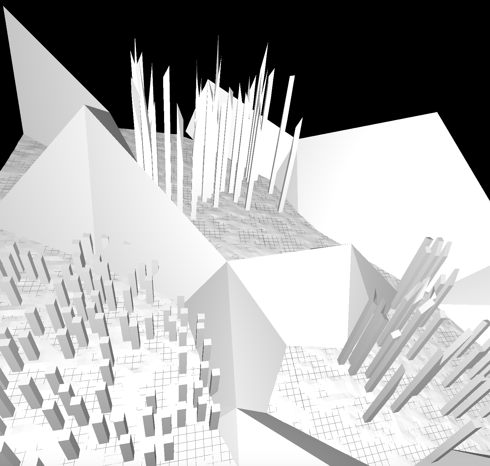

# CG Projekt
**R. Schwarzentruber, M. Nebroj, S. Ineichen**

## Einleitung
Ziel dieses Projekts ist es eine randomisierte Stadt in Houdini zu generiern und mit Hilfe von THREE.js im Browser zu rendern. Zusätzlich soll es möglich sein, sich in der generierten Stadt zu bewegen und weitere Objekte (`*.obj` Files) in die Webapp einzubinden.

## Umsetzung
### Stadt mit Houdini
* **Komponente "Stadt"**
    Es wurde eine Komponente "Stadt" erzeugt, die unterschiedliche Parameter hat.
    Dazu gehören die Grundfläche, die Anzahl Häuser, die Grösse und die Konturen.

* **Komponente "Ground & Mountain"**
    Die Komponente "Ground & Mountain" besteht aus einem Grid, welches den Boden darstellt und einem weiteren Grid,
    welches die Berge darstellt. Beide Grids werden schliesslich zu einem einzelnen Grid verschmolzen.

* **Zusammenführung**
    Für das Finale Objekt wurden drei "Stadt" Komponenten und eine "Ground & Mountain" Komponente zusammengeführt.
    Die Stadt Objekte haben jeweils unterschiedliche Parameter, um verschiedene Städte zu erzeugen.

### Webapp mit THREE.js
Die Webapplikation fungiert als `*.obj` Viewer. Man kann mit Hilfe einer Konfiguration die
unterstützten `*.obj` Files definieren. Auf der Webseite kann dann mit einem Dropdown das `*.obj` File
gewählt werden. Die Bewegungsgeschwindikeit kann separat eingestellt werden. Die Kamera-Position wird im Web-Interface dargestellt.

#### Bewegung
| Position      	| Rotation               	|
|---------------	|------------------------	|
| W - Vorwärts  	| F - Nach Links drehen  	|
| S - Rückwärts 	| H - Nach Rechts drehen 	|
| A - Links     	| T - Nach Oben schauen  	|
| D - Rechts    	| G - Nach Unten schauen 	|
| Q - Hoch      	|                        	|
| E - Runter    	|                        	|

\pagebreak

## Tools

### Houdini
Houdini ist ein Werkzeug, um 3D Szenen zu erzeugen. Es kann für Film & TV, Games, Motion Graphics und auch VR
genutzt werden. Extrem spanned sind vor allem die Möglichkeiten, welche durch die Nodes basierte Verarbeitung
ermöglicht werden. So können zum Beispiel einfach Objekte verschmolzen werden. Mehr Informationen zum Tool findet man auf der offiziellen Website von SideFX (Link unter Credits).

### Three.js
THREE.js ist eine Javascript Bibliothek, welche für 3D Darstellungen im Browser verwendet wird.
Sie basiert auf WebGL, hat aber von Haus aus viele nette Funktionen, welche das Leben in der 3D
Programmierung extrem erleichtern.

### Python (Webserver)
W$hrend des Projekts wurde ein Python Webserver verwendet, um eine lokale Entwicklung zu ermöglichen.

## Webapp starten
1. `../hslu-cg-houdini/webapp` mit Webstorm öffnen und index.html aufmachen
    oder
2. `../hslu-cg-houdini/webapp/localwebserver.py` mit Python starten und http://localhost:8080
    in einem Webbrowser öffnen

## Houdini Projekt bearbeiten
Das Houdini Projekt befindet sich im Ordner `../hslu-cg-houdini/houdini`.
Wenn die Webapp angepasst werden soll, muss in Houdini `*.obj` Export gemacht werden.
Dafür wird der gewünschte Knoten selektiert und mit einem Rechts-Klick kann dann
ein `*.obj` File gespeichert werden. Die `*.obj` Files sind im Ordner `../hslu-cg-houdini/webapp/obj`
abgelegt und werden im File `../hslu-cg-houdini/webapp/config.json` referenziert.

## Credits

### THREE.js

* [Webseite THREE.js](https://threejs.org)

### THREE.js *.obj Loader

* [*.obj Loader](https://threejs.org/docs/#examples/loaders/OBJLoader)

### Houdini

* [Dokumentation SideFX](https://www.sidefx.com/tutorials/)

### Pandoc

* PDF generierung von Markdown Files

    [Webseite](https://pandoc.org)